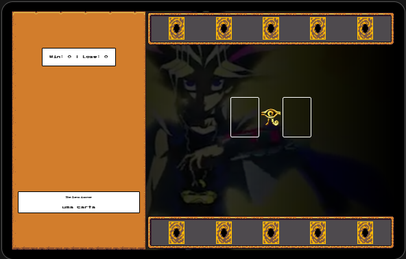

# Projeto: Yu-Gi-Oh Jo-Ken-Po Edition

Este projeto é uma versão personalizada do clássico jogo "Pedra, Papel e Tesoura", mas com cartas inspiradas no universo de *Yu-Gi-Oh!*. A dinâmica do jogo segue as regras tradicionais, mas as cartas possuem poderes especiais que se relacionam aos tipos do jogo, ou seja, "Pedra" (Rock), "Papel" (Paper) e "Tesoura" (Scissors), e são representadas por monstros icônicos da série como o **Blue Eyes White Dragon**, o **Dark Magician** e o **Exodia**.

## Funcionalidades

- **Interface Visual:** O design é inspirado no tema de *Yu-Gi-Oh!*, com vídeos de fundo e áudio de batalha para criar uma atmosfera imersiva.
- **Cartas Dinâmicas:** Cada carta tem um nome, tipo (Pedra, Papel ou Tesoura) e imagem representando um monstro famoso do anime.
- **Pontuação:** O jogo mantém o placar entre o jogador e o computador, mostrando as vitórias e derrotas de cada um.
- **Animações e Efeitos Visuais:** Ao selecionar e jogar as cartas, o jogo exibe animações e efeitos visuais para tornar a experiência mais interativa.
- **Música de Fundo:** Um áudio contínuo de batalha, inspirado no tema de *Yu-Gi-Oh!*, toca durante o jogo para manter a ambientação.

## Tecnologias Utilizadas

- **HTML5:** Estrutura e organização do conteúdo da página.
- **CSS3:** Estilo e design responsivo com uso de gradientes e transições.
- **JavaScript:** Lógica do jogo, controle de interação com o usuário, manipulação de elementos DOM e controle de áudio.
- **Fontes e Ícones:** Utilização de fontes e ícones específicos do universo *Yu-Gi-Oh!*, além de efeitos de cursor personalizados para tornar a experiência mais imersiva.

## Como Jogar

1. **Selecione uma carta**: O jogador pode escolher uma carta clicando sobre ela. Cada carta representa um monstro com um tipo (Pedra, Papel ou Tesoura).
2. **Desafie o computador**: O computador escolherá uma carta aleatória para enfrentar a do jogador.
3. **Veja o resultado**: O resultado da batalha será exibido e a pontuação será atualizada.
4. **Reinicie a batalha**: Após cada rodada, o jogador pode clicar no botão "Ganhou" para reiniciar o duelo.

## Regras do Jogo

As cartas funcionam da seguinte forma:
- **Blue Eyes White Dragon** (Papel) derrota **Dark Magician** (Pedra), mas perde para **Exodia** (Tesoura).
- **Dark Magician** (Pedra) derrota **Exodia** (Tesoura), mas perde para **Blue Eyes White Dragon** (Papel).
- **Exodia** (Tesoura) derrota **Blue Eyes White Dragon** (Papel), mas perde para **Dark Magician** (Pedra).
